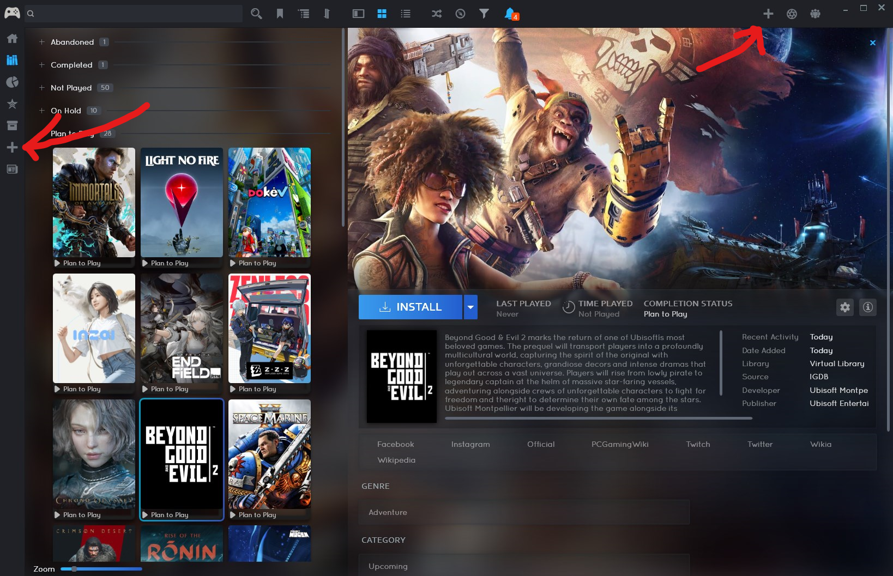

# Virtual Library Playnite Add-on

I wanted to add upcoming games not specifically tied to any platforms, so I made this add-on.

It allows adding any game easily through a simple link/name given a [source provider](#supported-sources) supports it.

Install the add-on through the usual means:
- [Download (if you have Playnite installed)](playnite://playnite/installaddon/VirtualLibrary)
- [Playnite Add-on Database](https://playnite.link/addons.html#VirtualLibrary)
- [Releases](https://github.com/iSplasher/PlayniteExtensions/releases)

## Usage

Upon installation you'll find a new button with a plus icon appear in your Sidebar and Top Panel. You can change the appearance of the button in the add-on settings.

> Theme is Helium and Grid View Cards.

Clicking the button will open a dialog where you can enter a link or name of the game you want to add. 

## Supported Sources

### Google Play

The links must point directly to the game's page.

For example: [`https://play.google.com/store/apps/details?id=com.miHoYo.GenshinImpact`](https://play.google.com/store/apps/details?id=com.miHoYo.GenshinImpact)

Tip: you can find all your games at [https://play.google.com/library/games](https://play.google.com/library/games).

### IGDB

Requires the [IGDB metadata provider](https://playnite.link/addons.html#IGDBMetadata_Builtin) to be installed as it depends on it for metadata collection.

The links must point directly to the game's page.

For example: [`https://www.igdb.com/games/genshin-impact`](https://www.igdb.com/games/genshin-impact)

### Adding custom sources

See [Contributing#Resolvers](#resolvers).

## Contributing

I welcome any contributions to this add-on. If you have any ideas or want to add support for a new source, feel free to open an issue or a pull request. 
The add-on currently fullfills my needs, so I can't guarantee I'll implement any feature requests. PRs are appreciated.

### Resolvers

Adding a new source resolver is easy.

If you want to add support for a new source, you can do so by adding a new class in [`src/resolvers`](src/resolvers/) that implements the [`IResolver`](/src/Resolver.cs) interface. 
The class will be instantiated and used through reflection, so you don't need to register it anywhere.

See how the existing resolvers are implemented for reference.
